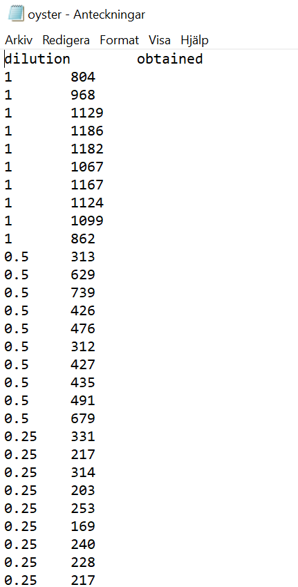

```{r, include = FALSE}
knitr::opts_chunk$set(
  collapse = TRUE,
  comment = "#>"
)
```

# Introduction 

The `EURLVerguide` application is intended to aid in verification and in-house validation of quantitative PCR-based methods in food virology. 

More specifically, the application is designed to analyse experiments where a dilution series of a virus has been used to artificially contaminate food samples. Typically for these experiments, a two fold dilution series is used to generate between 6-12 dilution levels (neat, 1/2, 1/4, ...) with 5-12 samples at each dilution level.   

By taking dilution level and obtained concentration of each sample as input data, the application generates the following information: 
 
* Anticipated concentration
* Information on whether the sample is detected or not
* Number of detected samples per dilution level
* Linearity
* Precision
* Limit of quantification

For more information on these performance parameters and how they are calculated, please see: ... or ...

The workflow is developed to analyse one target virus, one method, and one food type.
               
# Installation 


To install foodvirus, start R (version 4.1) and enter: 

``` r
if (!requireNamespace("devtools", quietly = TRUE))
  install.packages("devtools")
devtools::install_github("sofpn/foodvirus")
```

# Instructions for use 

## Start the application 

To start the application, type the following code in the R console:

```r 
foodvirus::runEURLVerguide()
```

The application should open in a new window. 

## Prepare data to upload 

The input data must be formatted as a table with two columns (variables): 

* dilution: describing the dilution factor of the seeding virus. A value of 1 should correspond to a "neat" dilution, a value of 0.5 to a 1/2 dilution, etc.  
* obtained: describing the obtained concentration of the sample, expressed in copies/g

One row should correspond to one sample. The table should be stored in a tab-separated .txt-file, with '.' as a decimal separator, as in the example below: 



# Session info 

This document was generated under the following conditions:

```{r}
sessionInfo()
```

